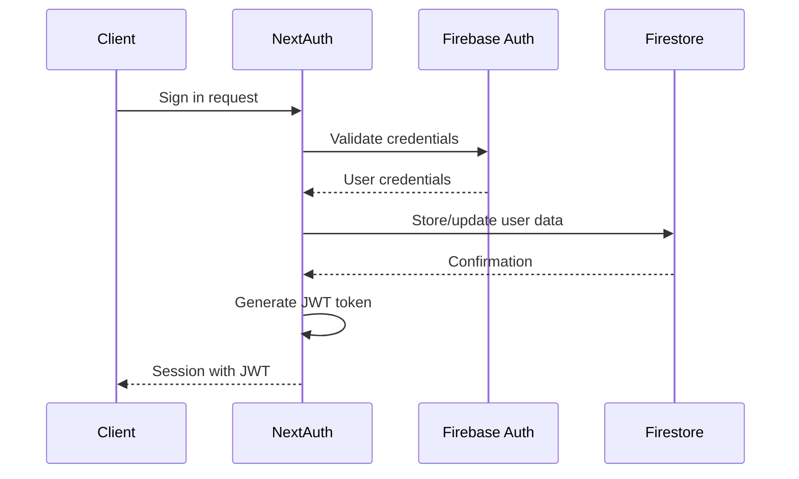

## Overview

The LSAT Training Platform uses NextAuth.js for authentication, integrated with Firebase for user management and data storage. The authentication system supports multiple providers and uses JWT-based sessions.

## Authentication Flow

The platform implements a hybrid authentication approach:

1. **NextAuth.js** handles the authentication logic and session management
2. **Firebase Authentication** manages credential validation
3. **Firestore** stores user profile data
4. **JWT tokens** maintain session state



## Supported Authentication Methods

### 1. Google OAuth

Users can sign in using their Google account through OAuth 2.0.

<CodeGroup>
```javascript Client-Side
import { signIn } from 'next-auth/react';

// Initiate Google sign-in
await signIn('google', { 
  callbackUrl: '/dashboard' 
});
```

```javascript Configuration
// Required environment variables
GOOGLE_CLIENT_ID=your_google_client_id
GOOGLE_CLIENT_SECRET=your_google_client_secret
```
</CodeGroup>

### 2. Email/Password Credentials

Traditional email and password authentication backed by Firebase.

<CodeGroup>
```javascript Client-Side
import { signIn } from 'next-auth/react';

const result = await signIn('credentials', {
  email: 'user@example.com',
  password: 'securepassword',
  redirect: false
});

if (result?.error) {
  console.error('Authentication failed:', result.error);
}
```

```javascript Firebase Direct
import { signInWithEmailAndPassword } from 'firebase/auth';
import { auth } from '@/lib/firebase';

const userCredential = await signInWithEmailAndPassword(
  auth, 
  'user@example.com', 
  'securepassword'
);
const user = userCredential.user;
```
</CodeGroup>

## Session Management

### JWT Strategy

The platform uses JWT (JSON Web Token) strategy for session management:

- **Token Storage**: HTTP-only cookies (secure)
- **Token Lifetime**: Configurable via NextAuth
- **User Data**: Fetched from Firestore on each session validation

### Session Object Structure

```typescript
interface Session {
  user: {
    id: string;          // Firebase UID
    email: string;       // User email
    name: string;        // Display name
    // Additional fields from Firestore user document
  };
  expires: string;       // ISO timestamp
}
```

### Accessing Current Session

<CodeGroup>
```javascript Client Component
import { useSession } from 'next-auth/react';

export default function Component() {
  const { data: session, status } = useSession();
  
  if (status === 'loading') {
    return <div>Loading...</div>;
  }
  
  if (status === 'authenticated') {
    return <div>Welcome, {session.user.name}!</div>;
  }
  
  return <div>Please sign in</div>;
}
```

```javascript Server Component
import { getServerSession } from 'next-auth';
import { authOptions } from '@/app/api/auth/[...nextauth]';

export default async function ServerComponent() {
  const session = await getServerSession(authOptions);
  
  if (!session) {
    return <div>Not authenticated</div>;
  }
  
  return <div>User ID: {session.user.id}</div>;
}
```

```javascript API Route
import { getServerSession } from 'next-auth';
import { authOptions } from '@/app/api/auth/[...nextauth]';

export async function GET(req: Request) {
  const session = await getServerSession(authOptions);
  
  if (!session) {
    return new Response('Unauthorized', { status: 401 });
  }
  
  // Proceed with authenticated request
  return Response.json({ userId: session.user.id });
}
```
</CodeGroup>

## Firebase Integration

### Client-Side Firebase

The platform initializes Firebase on the client for authentication operations:

```javascript
// Initialized services
import { auth, db, storage } from '@/lib/firebase';

// Available services:
// - auth: Firebase Authentication
// - db: Firestore Database
// - storage: Firebase Storage
```

### Server-Side Firebase Admin

Firebase Admin SDK is used for server-side operations:

```javascript
import { db } from '@/lib/firebaseAdmin';

// Server-side Firestore access with admin privileges
const userDoc = await db.collection('users').doc(userId).get();
```

### Required Environment Variables

<ParamField path="NEXT_PUBLIC_FIREBASE_API_KEY" type="string" required>
  Firebase project API key (client-side)
</ParamField>

<ParamField path="NEXT_PUBLIC_FIREBASE_AUTH_DOMAIN" type="string" required>
  Firebase authentication domain (client-side)
</ParamField>

<ParamField path="NEXT_PUBLIC_FIREBASE_PROJECT_ID" type="string" required>
  Firebase project ID (client-side)
</ParamField>

<ParamField path="NEXT_PUBLIC_FIREBASE_STORAGE_BUCKET" type="string" required>
  Firebase storage bucket (client-side)
</ParamField>

<ParamField path="NEXT_PUBLIC_FIREBASE_MESSAGING_SENDER_ID" type="string" required>
  Firebase messaging sender ID (client-side)
</ParamField>

<ParamField path="NEXT_PUBLIC_FIREBASE_APP_ID" type="string" required>
  Firebase app ID (client-side)
</ParamField>

<ParamField path="NEXT_PUBLIC_FIREBASE_MEASUREMENT_ID" type="string">
  Firebase Analytics measurement ID (client-side, optional)
</ParamField>

<ParamField path="FIREBASE_CLIENT_EMAIL" type="string" required>
  Firebase service account email (server-side)
</ParamField>

<ParamField path="FIREBASE_PRIVATE_KEY" type="string" required>
  Firebase service account private key (server-side)
</ParamField>

<ParamField path="NEXTAUTH_SECRET" type="string" required>
  Secret key for NextAuth JWT encryption
</ParamField>

<ParamField path="GOOGLE_CLIENT_ID" type="string" required>
  Google OAuth client ID
</ParamField>

<ParamField path="GOOGLE_CLIENT_SECRET" type="string" required>
  Google OAuth client secret
</ParamField>

## User Data Storage

### Firestore User Document

When a user authenticates, their data is stored in Firestore:

```javascript
// Collection: users
// Document ID: Firebase UID
{
  id: "firebase_uid_here",
  email: "user@example.com",
  name: "User Name"
}
```

### Data Synchronization

- **On Sign-In**: User data is created/updated in Firestore
- **On Session Load**: User data is fetched from Firestore and attached to session
- **On Profile Update**: Changes are persisted to Firestore

## Security Best Practices

<AccordionGroup>
  <Accordion title="JWT Secret Management">
    The `NEXTAUTH_SECRET` should be a strong, randomly generated string:
    
    ```bash
    # Generate a secure secret
    openssl rand -base64 32
    ```
    
    Never commit this secret to version control.
  </Accordion>

  <Accordion title="Firebase Private Key">
    The `FIREBASE_PRIVATE_KEY` contains newline characters that must be properly escaped:
    
    ```javascript
    // The code automatically handles this
    privateKey: process.env.FIREBASE_PRIVATE_KEY?.replace(/\\n/g, "\n")
    ```
    
    Store the key with literal `\n` strings in your `.env` file.
  </Accordion>

  <Accordion title="Client vs Server Environment Variables">
    - **NEXT_PUBLIC_**: Exposed to the browser, use for client-side Firebase
    - **No prefix**: Server-only, use for sensitive credentials
    
    Never prefix sensitive keys like `FIREBASE_PRIVATE_KEY` with `NEXT_PUBLIC_`.
  </Accordion>

  <Accordion title="Session Validation">
    Always validate sessions on protected routes:
    
    ```javascript
    const session = await getServerSession(authOptions);
    if (!session) {
      return new Response('Unauthorized', { status: 401 });
    }
    ```
  </Accordion>
</AccordionGroup>

## Error Handling

### Common Authentication Errors

<ResponseField name="Invalid email or password" type="error">
  Returned when credentials don't match any Firebase user or the password is incorrect.
  
  ```javascript
  {
    error: "Invalid email or password"
  }
  ```
</ResponseField>

<ResponseField name="Email and password are required" type="error">
  Returned when the sign-in request is missing required credentials.
  
  ```javascript
  {
    error: "Email and password are required"
  }
  ```
</ResponseField>

<ResponseField name="Configuration Error" type="error">
  Occurs when required environment variables are missing or invalid.
  
  Check that all required Firebase and OAuth configuration is set.
</ResponseField>

### Error Handling Example

```javascript
import { signIn } from 'next-auth/react';

try {
  const result = await signIn('credentials', {
    email: email,
    password: password,
    redirect: false
  });
  
  if (result?.error) {
    // Handle authentication error
    if (result.error === 'Invalid email or password') {
      setError('Invalid credentials. Please try again.');
    } else {
      setError('An unexpected error occurred.');
    }
  } else if (result?.ok) {
    // Success - redirect to dashboard
    router.push('/dashboard');
  }
} catch (error) {
  console.error('Sign-in error:', error);
  setError('Failed to sign in. Please try again.');
}
```

## Sign Out

To sign out a user and clear their session:

```javascript
import { signOut } from 'next-auth/react';

// Sign out with redirect
await signOut({ callbackUrl: '/login' });

// Sign out without redirect
await signOut({ redirect: false });
```

## Next Steps

<CardGroup cols={2}>
  <Card title="NextAuth API" icon="key" href="/api/auth/nextauth">
    Detailed NextAuth endpoint documentation
  </Card>
  <Card title="User Profile" icon="user" href="/api/user/profile">
    Managing user profiles and data
  </Card>
  <Card title="User Onboarding" icon="clipboard" href="/api/user/onboarding">
    Complete user onboarding workflow
  </Card>
  <Card title="Update User Data" icon="edit" href="/api/user/update">
    Update user information and preferences
  </Card>
</CardGroup>